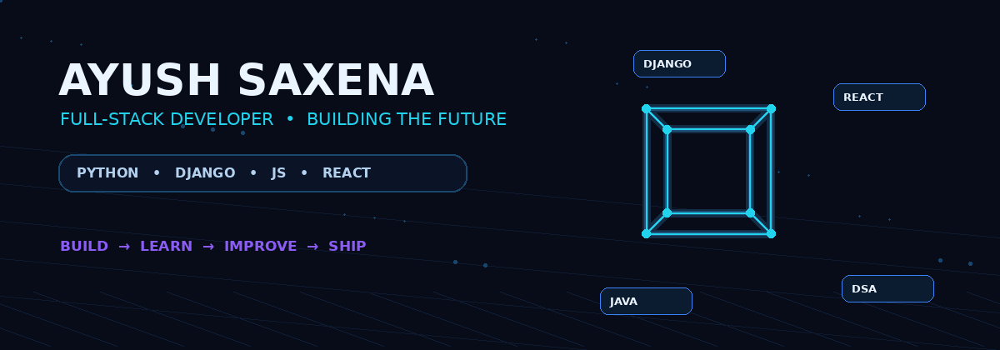

<div align="center">



<br/><br/>


<br/><br/>

<a href="https://github.com/Ayush2809-tech">
  
</a>
<a href="https://www.linkedin.com/in/ayush-saxena-2809s/">
  
</a>
<a href="mailto:saxenaayush2809@gmail.com">
  
</a>

</div>

---

# 👨‍💻 About Me

```text
                                    ╭──────────────────────────────────────────────────────────────╮
                                    │                    My PROFILE                                │
                                    ├──────────────────────────────────────────────────────────────┤
                                    │ 👤 Name       → Ayush Saxena                                │
                                    │ 🎓 Education  → B.Tech CSE (AI & ML)                        │
                                    │ 🚀 Focus      → Full-Stack Development                      │
                                    │ 🐍 Backend    → Python & Django                             │
                                    │ ⚛️ Frontend   → JavaScript & React                          │
                                    │ ☕ DSA        → Java & Problem Solving                      │
                                    │ 🎯 Mission    → Build useful real-world applications        │
                                    ╰──────────────────────────────────────────────────────────────╯
```

I am focused on building practical web applications and improving my skills through **real projects, backend development, modern frontend technologies, databases, deployment, and DSA**.

<div align="center">

### 💡 IDEA → CODE → BUILD → DEPLOY → IMPROVE

</div>

---

# ⚡ Current Focus

<div align="center">

| 🚀 BUILDING | 🧠 LEARNING | 🎯 IMPROVING |
|---|---|---|
| Full-Stack Applications | JavaScript & React | DSA with Java |
| Django Backends | REST APIs | Problem Solving |
| Production Projects | Database Design | Deployment Skills |

</div>

---

# 🚀 Featured Projects

<table>
<tr>
<td width="33%" valign="top">

## 🎓 Aurelix

### Student Management System

A production-oriented Django application for managing student-related operations.

**Highlights**
- 🔐 Authentication & Authorization
- 👨‍🎓 Student Management
- 📊 Dashboard
- 📥 Excel Import & Export
- 📧 Email Automation
- ☁️ Cloudinary
- 🐘 PostgreSQL

<br/>

<a href="https://aurelix-9q4e.onrender.com/">

</a>

<br/><br/>

<a href="https://github.com/Ayush2809-tech/Aurelix">

</a>

</td>

<td width="33%" valign="top">

## 🧬 Biotech Park

### Online Admission System

A full-stack admission platform developed for **Biotech Park, Lucknow** during my Python & Django internship.

**Highlights**
- 📝 Online Admission Workflow
- 🔐 Authentication
- 🧑‍💼 Admin Management
- 💳 Payment Integration
- 📧 Email Functionality
- 🗄️ Database Operations

<br/>

<a href="https://github.com/Ayush2809-tech/BTech-Park-Admission-System">

</a>

</td>

<td width="33%" valign="top">

## 🎨 EduRegister

### Student Registration UI

A responsive frontend project focused on UI development and user experience.

**Highlights**
- 🎥 Video Background
- 📱 Responsive Layout
- 🎨 Custom CSS
- 🧩 Bootstrap Components
- ⚡ JavaScript Interaction

<br/>

<a href="https://ayush2809-tech.github.io/EduRegister-Student-Registration-UI/">

</a>

<br/><br/>

<a href="https://github.com/Ayush2809-tech/EduRegister-Student-Registration-UI">

</a>

</td>
</tr>
</table>

---

# 🧰 Tech Stack

## 💻 Languages

<div align="center">

</div>

## 🎨 Frontend

<div align="center">

</div>

## ⚙️ Backend

<div align="center">

</div>

## 🗄️ Databases

<div align="center">

</div>

## 🧑‍💻 Tools & Platforms

<div align="center">

<br/><br/>


</div>

---

# 📊 GitHub Analytics

<div align="center">


</div>

<br/>

<div align="center">

<!-- Screenshot-style language donut card -->


</div>

<br/>

<div align="center">


</div>

---

# 🐍 Animated Contribution Snake

<div align="center">


</div>

> The snake animation is generated automatically from your real GitHub contribution graph.

---

# 📚 Currently Learning

```text
☕  Data Structures & Algorithms with Java
⚛️  JavaScript & React
🐍  Advanced Django & Backend Development
🌐  REST APIs
🗄️  Database Design
🚀  Full-Stack Application Development
```

---

# 🤝 Let's Connect

<div align="center">

<a href="https://github.com/Ayush2809-tech">

</a>

<a href="https://www.linkedin.com/in/ayush-saxena-2809s/">

</a>

<a href="mailto:saxenaayush2809@gmail.com">

</a>

</div>

---

<div align="center">

## ⚡ BUILD • LEARN • IMPROVE • SHIP ⚡

</div>
